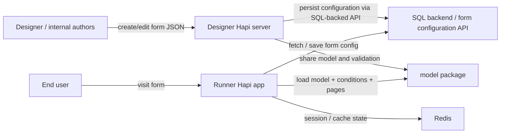

# Digital Form Builder

This repository is a monorepo for the internal form authoring and runtime stack used to build, validate, and publish digital forms. The system is split into three main workspaces:

- designer: internal authoring app for form creation and configuration
- model: shared schema and domain model that validates form JSON and supports runtime logic
- runner: public-facing Hapi application that renders and processes forms for end users

The project is built around a metadata-driven form model: designers define form structure in JSON, the shared model validates that structure, and the runner interprets it at runtime to render pages, conditions, calculations, lists, and outputs.

## Repository structure

```text
.
├── designer/          # Internal application used by form authors / PO team
├── model/             # Shared schema, form model, validation, migration logic
├── runner/            # Public Hapi app that renders forms
├── smoke-tests/       # Browser-based regression checks
├── Azure/             # deployment / infrastructure configuration
├── docker-compose.yml
├── docker-compose.dev.yml
├── package.json
├── README.md
└── docs/
```

## High-level architecture



The important architectural point is that this repo does not keep all form data in a local database. The application layer typically talks to a SQL-backed API exposed through environment variables such as `DF_SQL_API_URL` and `DF_SQL_API_KEY`. The designer and runtime use those values to query or update configuration, mappings, cached state, and related resources.

---

## 1. Designer

The designer is the internal authoring application used by the Product Owner team and internal authors to create, manage, and publish forms.

### Purpose

The designer is a React + Hapi app and acts as the authoring environment for:

- pages and sections
- components (questions, fields, actions, grouping blocks)
- calculations and computed outputs
- table-style data entry and parent/child relationships
- repeatable sections
- lists and datasets
- condition-driven flow and decision logic
- form configuration metadata and publishing state

This is the environment where the business definition of a form is created in a structured, metadata-driven way rather than hard coded in code.

### Core design

The designer uses:

- React for the front-end authoring experience
- Hapi for the server layer
- MSAL for Microsoft Entra ID authentication
- shared schema validation from the model package
- SQL-backed APIs for persisted configuration

The main app entry and Hapi integration live in:

- `designer/server/createServer.ts`
- `designer/server/plugins/designer.ts`
- `designer/server/config.ts`
- `designer/client/auth/clientApplication.ts`
- `designer/client/config/authConfig.ts`

### MSAL and internal access

The designer client is configured to use Azure AD / Microsoft Entra authentication through `@azure/msal-browser` and `@azure/msal-react`.

The app identifies a tenant, client ID, and redirect URIs based on the running environment (`local`, `development`, `test`, `preproduction`, `production`). This is how the internal authoring app restricts access to trusted users.

Typical flow:

1. User loads the designer app
2. MSAL creates a public client application
3. User logs in with Microsoft identity
4. The app stores the active account and redirects back into the designer dashboard
5. The designer then loads and manages form configuration data

This is a strong fit for an internal admin tool, not a public form runner.

### SQL integration in the designer

The designer is not directly wired to a SQL server library in the repo. Instead, it consumes a SQL-backed API through configuration:

- `DF_SQL_API_URL`
- `DF_SQL_API_KEY`

Relevant implementation points include:

- `designer/server/constants.ts`
- `designer/server/utils.ts`
- `designer/server/plugins/routes/api-v2/formConfigurationsApi.ts`
- `designer/server/plugins/routes/api-v2/providerMappingApi.ts`

The designer sets the API base and adds the APIM subscription key on outbound calls. In practice, this means the designer acts as a gateway to an external form configuration service while still giving users a rich UI for authoring forms.

---

## 2. Model

The model package is the shared domain layer for the form definition and validation engine.

### Purpose

This package contains the form graph, conditions, rules, component model, validation models, and migration logic. It is used across the repo so the designer and runner stay aligned on the same schema expectations.

### What it contains

The shared model is responsible for:

- page definitions
- section definitions
- components and list items
- datasets and calculations
- condition groups and expressions
- validation schemas
- migration/version handling for backwards compatibility

Key files:

- `model/src/schema/schema.ts`
- `model/src/migration/`
- `model/src/conditions/`
- `model/src/` for form metadata utilities

### Joi validation

The model package makes extensive use of Joi to define the shape of valid form JSON and reject invalid objects before they are used by the runner.

Examples from the schema include:

- section validation
- condition validation
- component validation
- page validation
- list validation
- calculation validation
- confirmation page validation
- output configuration validation

This is critical because the form model is highly nested and dynamic. A single wrong field shape can break rendering, calculation, data collection, or submission processing.

### Validation philosophy

Joi is used as a guardrail at multiple layers:

- environment config validation in Hapi server config files
- form schema validation in the model package
- runtime route validation where request payloads must conform to expectations

This reduces invalid data entering the system and ensures form definitions remain predictable and testable.

---

## 3. Runner

The runner is the public-facing Hapi application responsible for rendering and processing digital forms for end users.

### Purpose

The runner takes a validated form definition and turns it into a user journey. It handles:

- page rendering
- condition logic
- validation of submitted answers
- calculations and totals
- session state
- caching and data persistence
- document / file uploads
- integrations with payment, send-by-email, notify, and data outputs

### Core runtime files

- `runner/src/server/index.ts`
- `runner/src/server/config.ts`
- `runner/src/server/plugins/session.ts`
- `runner/src/server/plugins/views.ts`
- `runner/src/server/plugins/router.ts`
- `runner/src/server/services/`
- `runner/src/server/plugins/engine/`

### Hapi server stack

The runner is built on Hapi and registers multiple plugins to cover the runtime lifecycle:

- session and cache
- rendering engine
- router and route validation
- rate-limiting
- authorization / auth
- views and templates
- blankie for CSP
- crumb for CSRF protection
- engine configuration

This modular plugin approach makes the app easier to reason about and keeps security and view concerns separated.

---

## 4. SQL database integration

This project integrates with a SQL-backed backend through API calls, not by embedding a direct SQL driver at the top level.

### What is happening

The designer and runner both read configuration values like:

- `DF_SQL_API_URL`
- `DF_SQL_API_KEY`

These values are used to build API requests against a remote backend service. The code adds API headers, performs HTTP calls, and stores or retrieves form metadata and related config.

Examples:

- `designer/server/utils.ts` adds the APIM subscription key when calling the SQL-backed API
- `designer/server/plugins/routes/api-v2/formConfigurationsApi.ts` handles persisted form configuration flows
- `runner/src/server/plugins/engine/services/formService.ts` contains logic to fetch or cache form and provider-related data

### Why this design

It allows the application to separate:

- form authoring ui
- shared form model
- public form rendering
- back-end data persistence

This is common in a multi-container or multi-app environment where a dedicated API layer owns all durable data access rather than each UI app talking to the database directly.

---

## 5. Redis integration

Redis is used for session and cache support, especially in the runner.

### Why Redis is used

Redis provides:

- shared session data
- cached form state
- temporary per-request or per-user state
- cookie password persistence across instances
- a faster path for data that should survive process restarts but not necessarily live long-term in a relational database

### Actual implementation

The key implementation points are:

- `runner/src/server/plugins/session.ts`
- `runner/src/server/services/redisService.ts`
- `runner/src/server/index.ts`
- `runner/src/server/utils/generateCookiePassword.ts`
- `docker-compose.yml`

### Session cache configuration

The runner configures a Hapi catbox provider:

- `@hapi/catbox-redis` provides the Redis-backed cache implementation
- `ioredis` is used for the actual Redis client connection
- when `REDIS_HOST` is absent, a memory fallback is used for local or test scenarios

The session plugin creates a shared cache named `session_cache`, then wires it into the `@hapi/yar` session layer. This means user session state is stored in a central cache rather than only in process memory.

### Cookie password persistence

The app also generates and persists a cookie password in Redis so multiple instances can share a stable session secret. This is important in clustered or multi-instance deployments.

The app checks `REDIS_HOST`, `REDIS_PORT`, `REDIS_PASSWORD`, and `REDIS_TLS` and falls back gracefully to in-memory behavior when Redis is not configured.

### Docker setup

The compose files run a Redis service with a password:

```yaml
redis:
  image: "redis:alpine"
  command: redis-server --requirepass 123abc
```

This is used by both designer and runner containers in the local stack.

---

## 6. Multi-core / PM2 and multinode deployment

The runner is intended to run in a clustered Node.js setup using PM2.

### PM2 configuration

`runner/ecosystem.config.js` contains the cluster configuration:

- `script: "./dist/index.js"`
- `instances: "max"`
- `exec_mode: "cluster"`

This means PM2 starts multiple worker processes to distribute incoming traffic across CPU cores.

### Why cluster mode

This approach gives:

- better concurrency without changing the application logic
- horizontal scaling within a single instance / machine
- easier deployment in production for node-based HTTP workloads

### Development override

In local development, the PM2 config switches to a single process and enables the inspector:

- `exec_mode: "fork"`
- `node_args: "--inspect=0.0.0.0:9229"`

This is useful for debugging because a single worker is easier to attach to from VS Code or other debuggers.

### Docker invocation

`docker-compose.yml` runs:

```bash
npx pm2-runtime ecosystem.config.js --env production
```

`docker-compose.dev.yml` uses the development configuration with live code mounting so you can iterate without rebuilding the whole image.

---

## 7. Nunjucks and view rendering

The runner uses `vision` plus `nunjucks` to render HTML templates for the public form pages.

### What is happening

The view plugin is registered in:

- `runner/src/server/plugins/views.ts`

It configures:

- an `html` template engine backed by Nunjucks
- template search paths including the runner views and GOV.UK components
- a shared context object with form metadata and page state

### Why this matters

Nunjucks is used to render GOV.UK styled pages with embedded dynamic placeholders such as:

- service name
- page title
- feedback links
- analytics IDs
- navigation / auth state
- per-page form data

This is what turns the metadata model into an actual HTML form experience for end users.

### Example integration

The runner registers the view engine with:

- `vision` as the Hapi template renderer
- `nunjucks.configure(...)` to set up the template environment
- `options.path` pointing to the app views and GOV.UK component directories

This makes it easy to reuse GOV.UK form components and keep the rendering coherent across pages and states.

---

## 8. Security and standards

This project includes several important security components.

### `blankie`

`blankie` is used to configure a Content Security Policy (CSP) for the app. This helps reduce the risk of XSS and limits what external scripts, styles, images, and connections are allowed.

Relevant files:

- `designer/server/plugins/blankie.ts`
- `runner/src/server/plugins/blankie.ts` (matching security pattern)

### `crumb`

`crumb` adds CSRF protection to form submission routes. This ensures state-changing requests must carry a valid anti-forgery token, reducing the chance of cross-site request attacks.

### `vision`

`vision` provides the Hapi view engine integration, enabling the app to render HTML templates with Nunjucks.

### `yar`

`@hapi/yar` is used for server-side session handling and is connected to the Redis-backed cache in the runner. This keeps session state consistent across distributed app instances.

### `msal`

The designer uses `@azure/msal-browser` to authenticate internal users via Microsoft identity and avoids exposing the authoring tool to unauthenticated or public traffic.

### HTTPS and HSTS

The server uses HSTS headers and secure route config to promote secure transport. The code also supports TLS certs through environment variables, and the app sets strict security headers as part of the Hapi request lifecycle.

---

## 9. Form model and component concepts

The form definitions are metadata-driven and can include conceptually rich structure such as:

- pages and sections
- components: text, date, list, upload, table, boolean, file, etc.
- conditional logic and calculation blocks
- repeatable sections
- parent/child relationships
- list sources and dataset mappings
- confirmation pages and custom output handlers

The `model` package is the formal contract behind all of this. It defines what valid pages, calculations, outputs, datasets, and conditions look like.

This keeps the authoring UI and the runtime app aligned. If a form author creates something that violates the model, validation catches it early.

---

## 10. Local development and running the project

### Prerequisites

- Node 18+
- Yarn
- Docker and Docker Compose (for Redis and local stack)
- optional: mkcert / local TLS setup depending on environment requirements
- create .env file in both designer and runner and copy the environment variables from Azure appservices and paste it in .env respecitive file i.e., designer or runner.

### Install dependencies

From the repo root:

```bash
yarn install
```

Or use the project helper script:

```bash
yarn setup
```

### Run the designer app

```bash
yarn designer dev
```

This runs the webpack watch process and the local Hapi app in development mode.

### Run the runner app

```bash
yarn runner dev
```

This compiles source files and runs the runner with local development settings.

### Run the full stack with Docker

```bash
docker-compose -f docker-compose.yml -f docker-compose.dev.yml up
```

This starts:

- designer on port `3000`
- runner on port `3009`
- Redis on port `6379`

---

## 11. Debugging

### VS Code / Node inspector

The runner PM2 development config exposes a debug port:

```text
0.0.0.0:9229
```

This is enabled through:

```js
node_args: "--inspect=0.0.0.0:9229"
```

Attach a debugger from VS Code or another Node inspector client to the running process.

### Typical debug workflow

- start the app in dev mode
- attach inspector
- set breakpoints in the relevant server files
- inspect request data, session state, and form config values

### Useful commands

```bash
yarn designer start:local
yarn runner start:local
```

If you want to run the production-like stack locally with Docker, use the compose setup above.

create a launch.json file and copy the following to run designer or runner in debugging mode easily

```
{
    // Use IntelliSense to learn about possible attributes. 
    // Hover to view descriptions of existing attributes. 
    // For more information, visit: https://go.microsoft.com/fwlink/?linkid=830387 
    "version": "0.2.0",
    "configurations": [
        {
            "command": "yarn designer start:local",
            "name": "Run designer",
            "request": "launch",
            "type": "node-terminal"
        },
        {
            "command": "yarn runner dev",
            "name": "Run Runner",
            "request": "launch",
            "type": "node-terminal"
        },
        {
            "name": "Attach to Designer Server Process",
            "type": "node",
            "request": "attach",
            "port": 9229
        },
        {
            "type": "msedge",
            "request": "attach",
            "name": "Attach to designer client",
            "address": "localhost:3000"
        },
        {
            "type": "msedge",
            "request": "launch",
            "runtimeArgs": [
                "--remote-debugging-port=9222"
            ],
            "name": "Launch designer client",
            "url": "http://localhost:3000/app/dashboard"
        },
        {
            "type": "msedge",
            "request": "launch",
            "runtimeArgs": [
                "--headless",
                "--remote-debugging-port=9222"
            ],
            "name": "Launch designer client in headless mode",
            "url": "http://localhost:3000/app/dashboard",
            "presentation": {
                "hidden": true
            }
        },
        {
            "type": "vscode-edge-devtools.debug",
            "name": "Open Edge DevTools",
            "request": "attach",
            "port": 9222,
            "presentation": {
                "hidden": true
            }
        }
    ],
    "compounds": [
        {
            "name": "Launch Edge Headless and attach DevTools",
            "configurations": [
                "Launch designer client in headless mode",
                "Open Edge DevTools"
            ]
        },
        {
            "name": "Launch Edge and attach DevTools",
            "configurations": [
                "Launch designer client",
                "Open Edge DevTools"
            ]
        },
        {
            "name": "Launch designer and attach devtools, debugger",
            "configurations": [
                "Launch designer client",
                "Attach to designer client",
                "Open Edge DevTools"
            ]
        },
    ]
}
```

---

## 12. Tests and coverage

This repo uses a mix of Hapi/Lab tests and Jest tests depending on the package.

### Run all workspace tests

```bash
yarn test
```

### Run coverage for all workspaces

```bash
yarn test-cov
```

### Package-level commands

```bash
yarn designer test
yarn runner test
yarn model test
yarn designer test-cov
yarn runner test-cov
yarn model test-cov
```

### Coverage output

The package scripts generate HTML and/or lcov output. Examples include:

- `designer/test-coverage/lab/unit-test.html`
- `runner/test-coverage/lab/unit-test.html`
- jest coverage output generated by each workspace locally during test runs

The repository is designed so that coverage is not just informational; the workspace scripts enforce thresholds so build quality can remain meaningful.

---

## 13. Notes and operational guidance

- The repo is a monorepo and should be run from the repository root, not from nested folders, unless the package script explicitly requires a workspace context.
- `yarn workspaces foreach run ...` is the main way to execute shared commands across packages.
- If `REDIS_HOST` is not set, the app will generally fall back to in-memory storage for local/test scenarios.
- The application is built around environment variables and a trench of configuration validation, so missing or malformed configuration will usually fail fast at startup.
- The designer is best thought of as an internal authoring platform, while the runner is the external-facing public form experience.

---

## 14. Contributing

Issues and pull requests are welcome. Please check [CONTRIBUTING.md](./CONTRIBUTING.md) before submitting changes.

---

## License

This project is distributed under the Open Government Licence (OGL) terms used by the project.

The relevant attribution is included in the repo as part of the project licensing information.
